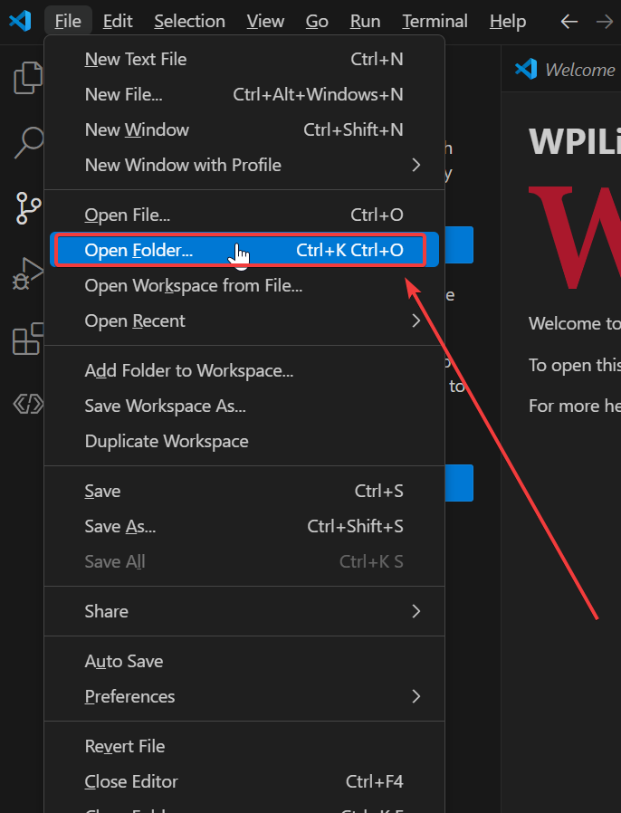
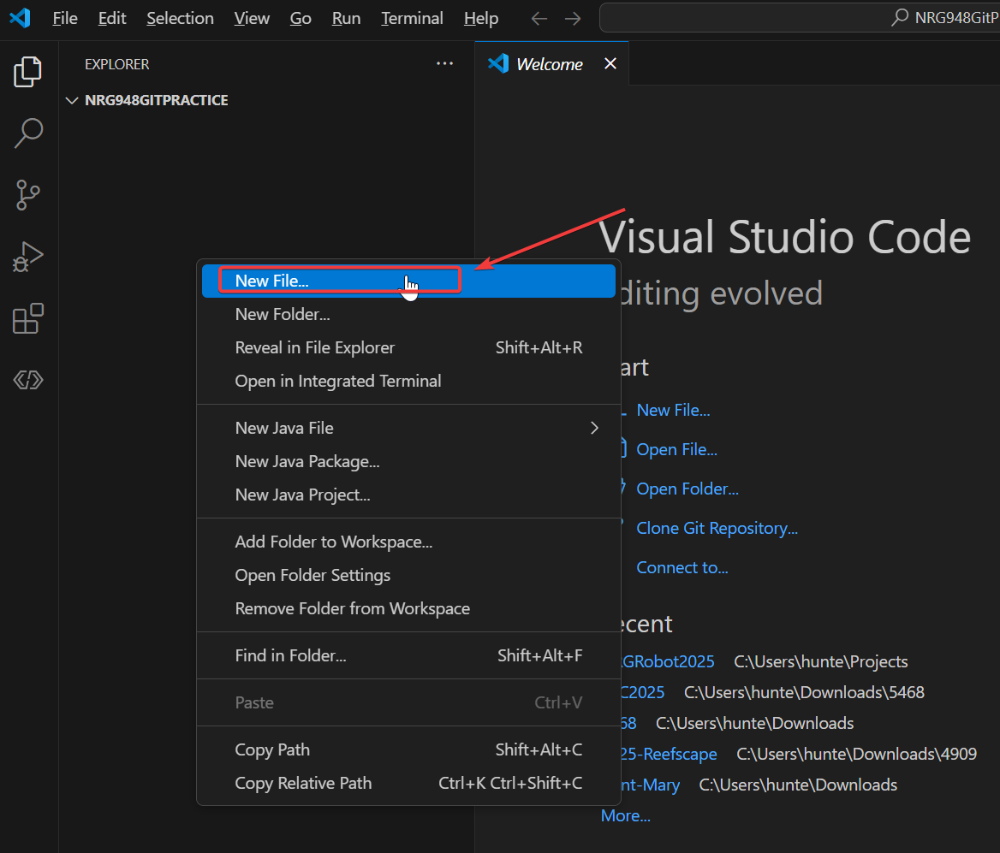
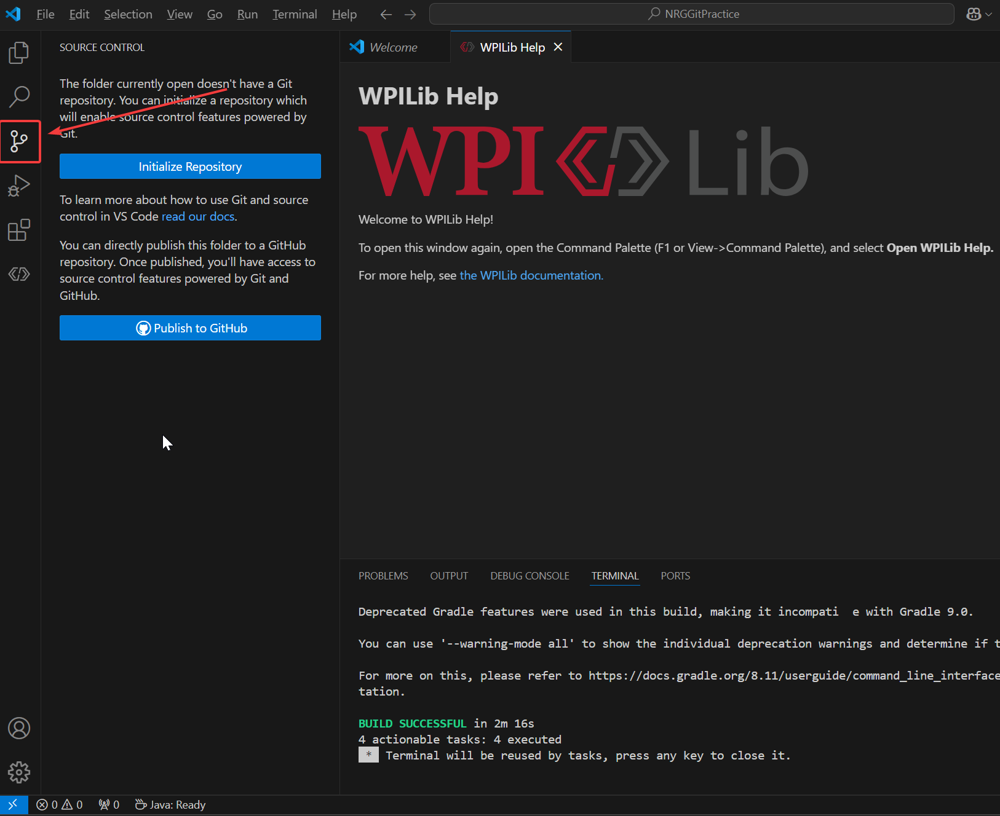
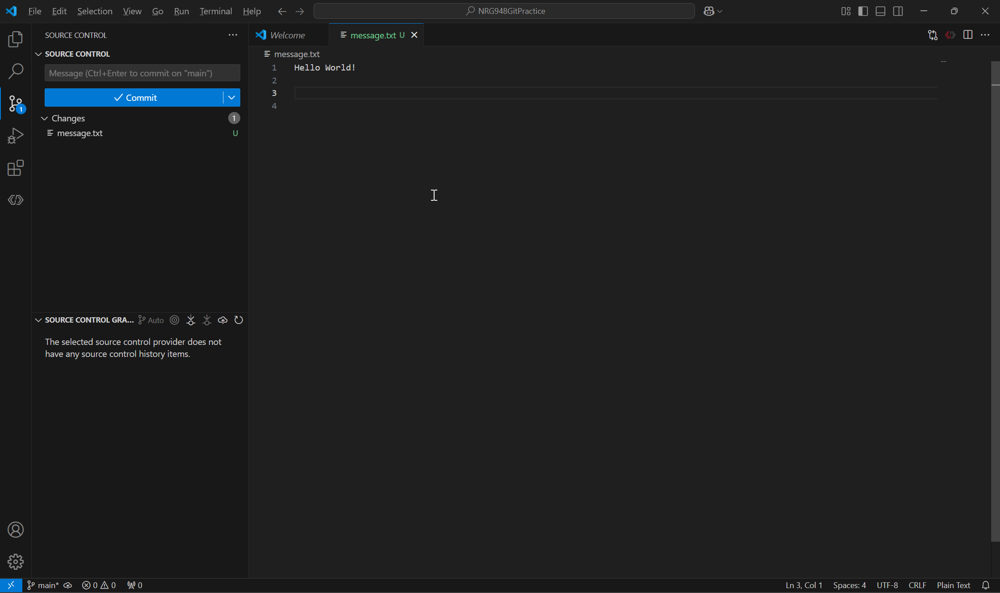
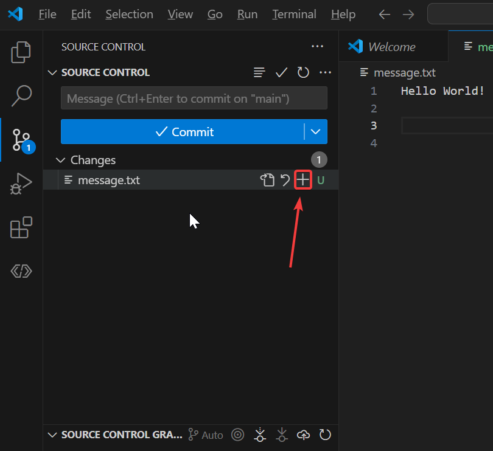
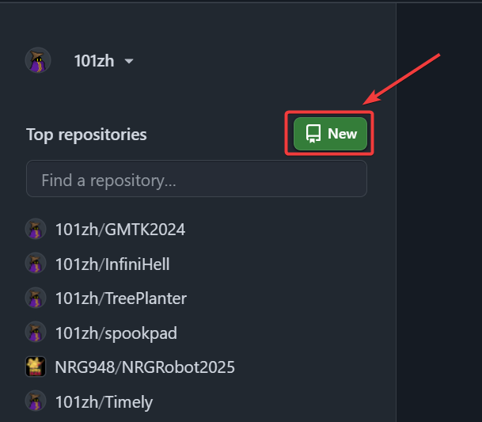
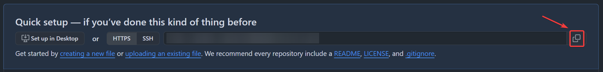
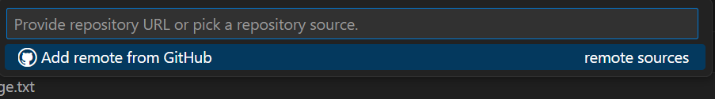
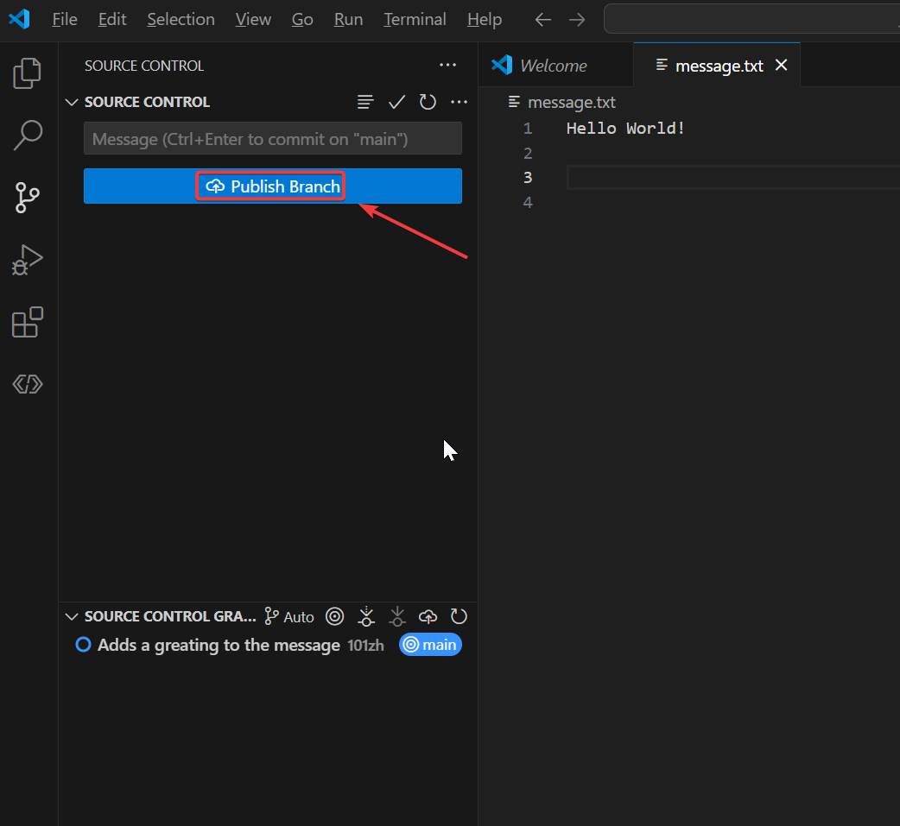

# How to Create a Repository and Upload it to GitHub

## Configuring Git

1. Open a new terminal and paste in the commands below
2. The name is your GitHub username and the email is the email that is associated with your GitHub account.

```bash
git config --global user.name "My GitHub Username"
git config --global user.email "myemail@example.com"
```

## Creating a Folder

1. Create a Folder (anywhere on your machine will do; just make sure you can access it)
2. Name it something like `NRG948GitPractice`
3. Now open that folder with VS Code\

4. Now right-click and create a new file\

5. Name it `message.txt`
6. Add a greating to the file

## Making a Git Repository

1. After you've created the file, open the source control tab\

2. Click `Initialize Repository`
3. Congrats! You've made a git repository.

## Making a Commit

1. Now your window should look something like this\

2. To make a commit you first need to **stage** your change
    - This tells Git which files you want to commit
3. Click the plus icon as shown in the image to stage\

4. Then write a commit message; do your best with the guidelines below
    - Commit messages should always start with a capitalized verb in the simple present tense
    - The best way to figure out the grammar to think this: "This commit \[insert-commit-message-here\]"
    - Ex: "This commit updates motor direction" -> `Updates motor direction` is your commit message
5. I wrote `Adds a greating to the message`, but there are other ways to phrase it here!
6. Now click the button, `Commit`
7. Congrats you created your first commit!

## Adding a remote repository

1. Open a new tab and go to [github.com](https://github.com/)
2. Click the new repository button\

3. Type the repository name in, which is the name of the folder you created
4. Then hit the `Create repository` button
    - Do **NOT** configure anything else
5. Copy the link that is shown on the page you are redirected to

6. If at any point from now on you are prompted by the Git Crendential Manager to sign-in, sign-in with your github email and password.
7. Now go back to VS Code and type `Ctrl + Shift + p`
8. Search for `Git: Add Remote...`
9. Paste in the link that you copied earlier

10. Type in the name of the repository if it prompts you
11. Click `Publish Branch` in the source control tab

12. Reload the GitHub website and you should see your remote repository!
