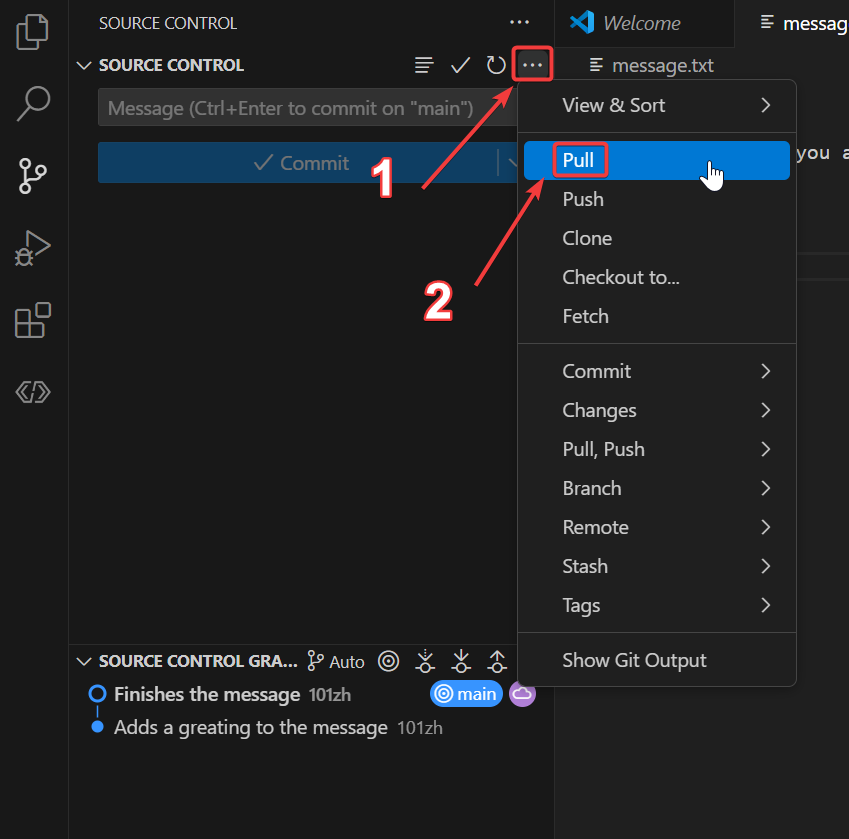

# Practicing Commits and Branches

## Drafting a Message

1. Reopen your local repository with VS Code if you have closed it
2. Write a sentence in `message.txt` and sign off with your GitHub username
3. Remember to save!\

4. Now make a commit including `message.txt` and with a **good** commit message
    - If you don't remember all the steps go to [the instructions where you last made a commit](../CreatingARemoteRepo/instructions.md#making-a-commit).
5. After committing, click `Sync Changes`. Sync changes both pulls and pushes changes to the remote repository.\

6. Check the remote repository on [github.com](https://github.com/) to see if the changes were pushed

## Editing the Message

Now we're going to edit the message you just wrote.

### Creating a New Branch

1. First, create a new branch because it's a new "*feature*"
    - Before creating make sure you're fully synced with main and are on the main branch
    - 
2. In the bottom-left corner of the screen, click the source control icon\

3. You should now see something like this at the top of your screen\

4. Click `Create new branch...`
5. Name the branch a name that would make sense
    - Ex: `MessageEditing`, `MessageRewriting`, `MessageCreation`, etc.
6. You'll know if you've created a branch if in the bottom-left corner it says the name of the branch you just created.

### Making Edits

1. Now make some changes to `message.txt`
    - Change who you're greating (make it more specific if possible)
    - Write at least one sentence on how you're doing
    - Add a funny "P.S." note at the end
2. After making these changes, make a commit and push those changes
3. Note: here you can push the changes, by publishing the branch

### Merging Back to the "main" branch

1. Open up the remote repository on [github.com](https://github.com/)
2. If you see the yellow banner, click `Compare & pull request`
    - If you don't see it go to the `Pull requests` tab, create a new pull request, and compare `main` as `base` & the `MesssageEditing` branch as `compare`

3. Create the pull request
4. Here, you would ususally have to wait for an approval from a programming mentor if it were robot code, but since it's your own repository you can merge immediately.
5. Because there is only one commit, squashing or rebasing here is a great option.
    - Note: in NRG when coding for the robot, you'll most likely squash for branches only with one commit
    - Squashing also may happen if commit history doesn't want to be preserved
6. Merge the branch according to the advice above; you can change merge options by clicking the small down arrow next to merge

## Writing a Profile

In addition to a message, we're going to write an introductory profile

### Profile Part 1

1. Create a new branch for this. (if you don't know how to do it refer to [previous instructions](#creating-a-new-branch))
    - Before creating make sure you're fully synced with main and are on the main branch
2. Create a new file
3. Name it `profile.txt`
4. Write 3 things in it
    - Your favorite food
    - Your favorite sport
    - Your favorite STEM thing
5. Now make a commit. Remember to stage, write a good commit message, and push the changes.

### Profile Part 2

1. This is the next part; pretty much write why these are your favorites.
2. No need to create a new branch since you're technically still working on the same "feature"
3. Add the reasons for why those things are your favorite in `profile.txt`.
4. Make another commit
5. After pushing your changes to the remote repository, make a pull request
6. Because we want to preserve the commit history, a merge or a rebase would be fine here.
    - Note: in robot code, NRG usually follows the workflow of rebasing
7. Merge the branch according to the advice above
